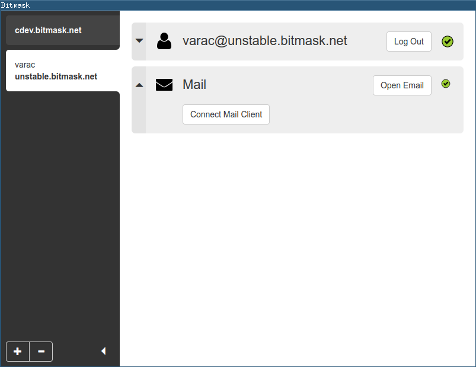

## While you wait

If you want to use `Vagrant` during this session
please start right away with downloading the
`LEAP/jessie` vagrantbox:

:thumbsup:

### vagrant box add LEAP/jessie

---


## LEAP Encryption Access Project
## Pixelated Project
### Platform Workshop

Kwadronaut (LEAP),  Varac (Pixelated, LEAP),   Zara (Pixelated)

```note
We'll briefly explain both projects later
```

---

## What to expect

- Have a LEAP provider installed, for real or for testing
- Focus on encrypted email (no VPN)
- Install Pixelated Webmail on top (optional)

```note
- Rush through the first part, then show more details during deploy phase (~20 mins)
```

---

## Prerequisites

- Have a working (!) Vagrant setup
- Or a remote sever/VM installed with fresh Debian stable OS
- A public/private ssh keypair to login your host

```notes
- We cannot help you / debug your vagrant issues here
- Otherwise, please pair with your neighbour

```

---

## LEAP Encryption Access Project

- "Provider in a box"
- VPN
- Encrypted email
- Strict client encryption

```note
- VPN: Cirumvent censorship, surveillance and geoblocking
- Email: Transparent email encryption and keymanagement
```

---

## Bitmask Client



- Formerly Python/Twisted
- Currently rewritten with Python/Javascript
- Only for Ubuntu/Debian Linux (VPN+Email) or Android (VPN)
- Windows and MacOS coming soon (with your help even faster!)

---

## Pixelated

- Encrypted Webmail on top of LEAP
- No installation hassle
- Private key will be unlocked on server

---

### Where to deploy to


Vagrant         | Remote Server
:-------------: | :-------------:
Locally on your laptop, for testing | Out there, for testing or real
Requires Vagrant and Virtualbox or other hypervisor | Physical or paravirtualized Server (KVM, Xen, OpenStack, Amazon, but not VirtualBox or OpenVZ)

---

# Tutorials

## Vagrant

- https://leap.se/en/docs/platform/tutorials/vagrant


## Single node email provider

- https://leap.se/en/docs/platform/tutorials/quick-start
- https://leap.se/en/docs/platform/tutorials/single-node-email

---

# Install pre-requisites

- Install leap-cli on your workstation/laptop, NOT on the server !

## Debian & Ubuntu

```
$ sudo apt install git ruby ruby-dev rsync openssh-client openssl rake make bzip2
```

## Mac OS

```
$ brew install ruby-install
$ ruby-install ruby
```

```notes
- `workstation$` indicates this command should be run on your laptop
```

---

## Install the LEAP command-line utility


```
$ sudo gem install leap_cli

$ leap --version
leap 1.9, ruby 2.3.3
...

```

---

# Prepare provider config

Use `example.org` for testing, or pick your own domain.

```
$ mkdir -p ~/leap/example.org
$ cd ~/leap/example.org
```

Leap Platform Build Status: [](https://0xacab.org/leap/platform/commits/master)
If the last build failed, we need to checkout the last stable version of the leap_platform:

```
git clone https://0xacab.org/leap/platform.git ../leap_platform
git checkout -b 0.9.0 0.9.0
```

```notes

```

---

# Create provider config

```
$ leap new .

The primary domain of the provider: |example.org|
The name of the provider: |Example|
File path of the leap_platform directory: |/home/varac/leap_platform|
Default email address contacts: |root@example.org|
The platform directory "/home/varac/leap/leap_platform" does not exist.
Do you want me to create it by cloning from the
git repository https://leap.se/git/leap_platform.git? y
...
```


```note
```

---

# Add your ssh key


```
$ leap add-user varac --self
```

---

# SSL certificates

Create SSL certificate authority, to self-sign host certificates:

```
$ leap cert ca
$ leap cert csr
```

---

# Option A: Add an existing remote server


```
$ leap node add wildebeest ip_address:0.1.2.3 services:webapp,couchdb,soledad,mx
```

```notes

```

---

# Option B: Create a new server in the cloud

- Currently works only with AWS ec2
- `cloud.json` needed for AWS config and credentials
- https://leap.se/en/docs/platform/guide/virtual-machines for details

```
$ leap vm key-register
$ leap vm add wildebeest services:webapp,couchdb,soledad,mx
$ leap vm status
```

```notes
- Only reocmmended for testing

  cp ~/leap/git/bitmask/cloud.json .
  grep -v 'aws_' cloud.json

- Takes 4 mins to finish - questions ?
- Otherwise show next slide while bootstrapping VM,
  and help out with vagrant
```


---

# Option C: Add your local vagrant node

```
$ leap node add --local wildebeest services:webapp,couchdb,soledad
$ leap local start wildebeest
$ leap local status
```

---

# Time to deploy !

```
$ leap list

$ leap node init wildebeest
$ leap deploy wildebeest
```

```notes
- Takes ~ 15 min to finish
- Time for a little platform presentation
```

---

# Test if things work correctly

```
$ leap test
```

---

# Setup DNS

We are using a fake domain here, so we need to override our DNS resolution.

```
$ leap compile hosts
```

You need to edit your `hosts` file with admin privileges and add the output of above command to it.

* Linux: `sudo editor /etc/hosts`
* MacOS: `sudo nano /private/etc/hosts`

see [Quick start tutorial/Setup DNS](https://leap.se/en/docs/platform/tutorials/quick-start#setup-dns) for details.

---

# Time to start Bitmask and your favorite mail client

- Install instructions: https://bitmask.net/en/install
- Debian/Ubuntu only at the moment, sorry

```notes
Show:

- Mail to myself
- Mail to/from other workshop participants
- Mail from outside (ssh cat)
...
```

---

# Install Pixelated

- see https://github.com/pixelated/puppet-pixelated for details

```
$ mkdir -p files/puppet/modules
$ git clone https://github.com/pixelated/puppet-pixelated.git files/puppet/modules/pixelated

$ mkdir -p files/puppet/modules/custom/manifests
$ echo 'class custom { include ::pixelated }' > files/puppet/modules/custom/manifests/init.pp

$ leap deploy wildebeest
$ leap test wildebeest
```

---

# Use Pixelated

- Register a user at https://example.org
- Login at https://example.org:8080/


---

# Try more

- LEAP: https://mail.bitmask.net (email) and https://demo.bitmask.net (VPN)
- Pixelated: https://try.pixelated-project.org/ (no outbound mail)

---

# Thanks!

- LEAP Encryption Access Project: [https://leap.se](https://leap.se)
- Bitmask Application: [https://bitmask.net](https://bitmask.net)
- Github: [https://github.com/leapcode](https://github.com/leapcode)
- Twitter: [https://twitter.com/leapcode](https://twitter.com/leapcode)
- https://pixelated-project.org/

Please consider to contribute - any help with QA or other is appreciated !
:heart:

