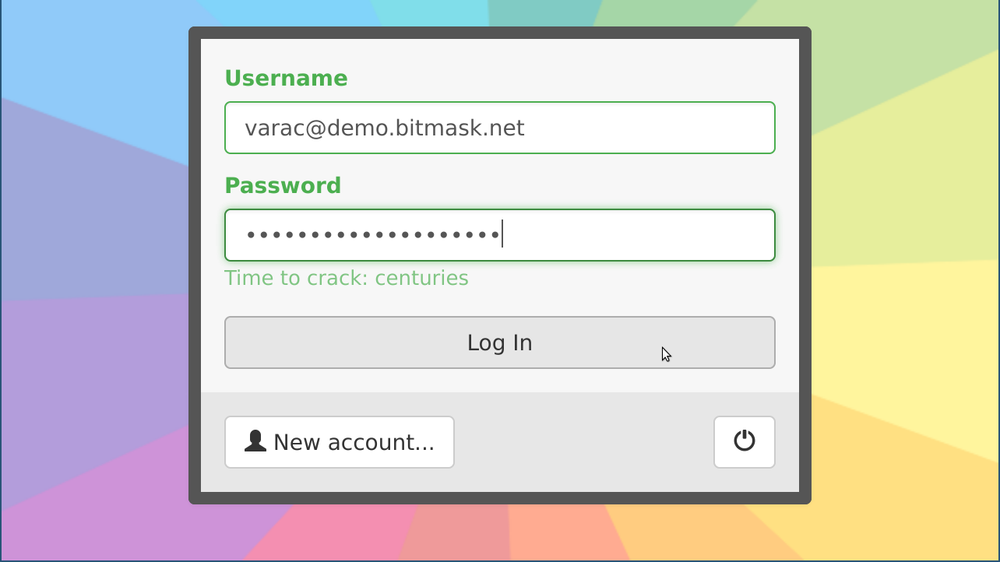
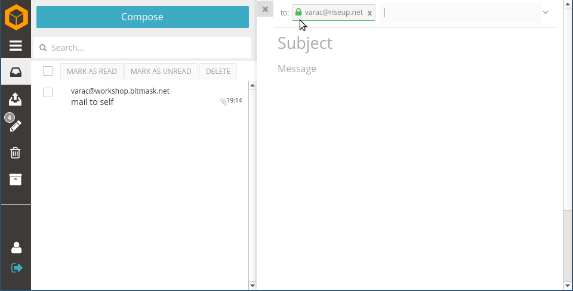
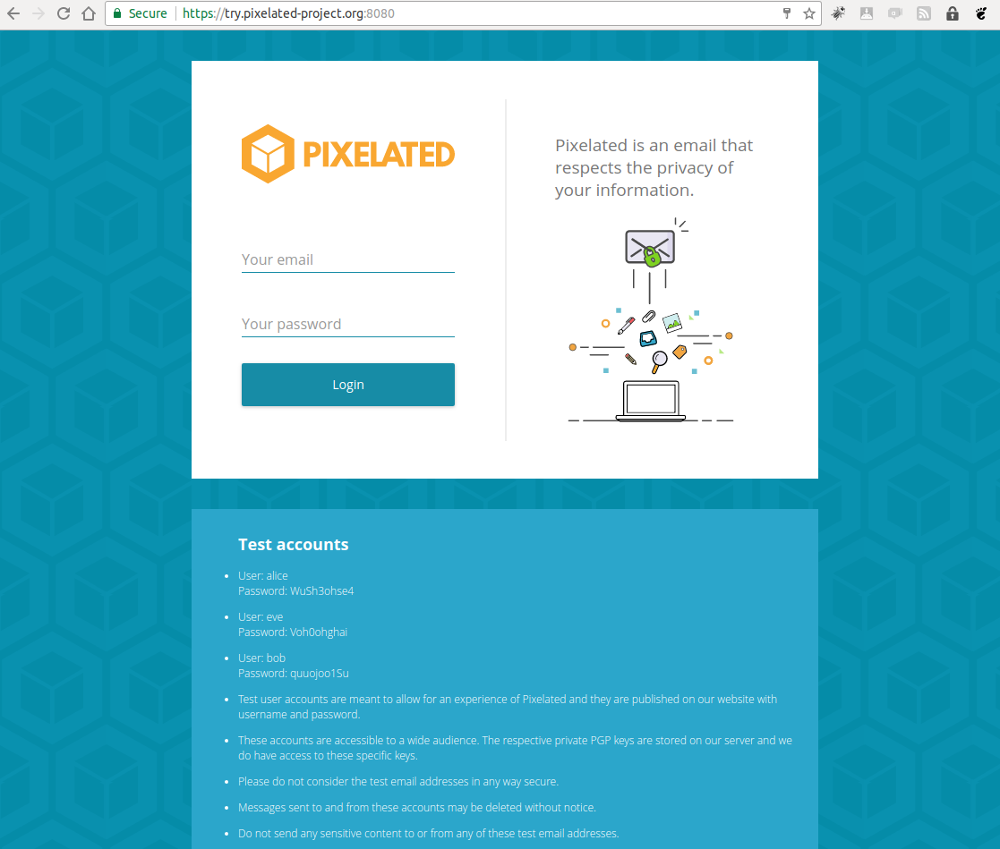

# LEAP Provider installation workshop

If you want to use Vagrant during this session
please start right away with downloading the
"LEAP/jessie" vagrantbox:

```
vagrant box add LEAP/jessie
```

---


# LEAP Encryption Access Project
## Provider installation workshop

 @varac (LEAP, Pixelated) 

```notes
Introduction:
  - working for LEAP since its start in 2012
  - The last 3 years for Pixelated, with build on LEAP
```

---

# What to expect

- Short introduction to LEAP
- Install LEAP provider that offers encrypted email (for real or for locally using vagrant)
- Test encrypted email using Bitmask client with new provider (sorry, Linux only)

```note
- Rush through the first part, then show more details during deploy phase (~20 mins)
- Focus on encrypted mail, VPN: Requires a second IP
```

---
# Prerequisites


- Have a working (!) Vagrant setup
  or a remote sever/VM installed with fresh Debian stable OS
- A public/private ssh keypair to login your host

```notes
- We cannot help you / debug your vagrant issues here
- Otherwise, please pair with your neighbour
- When you are stuck, pls tell us - if it can be fixed easily, great. If not, pls just continue to watch the demo,
  we can help you out later.
- Who wants to use vagrant/a remote sever ?
```

---

# Goals

- "Provider in a box"
- Make encryption as easy to use as possible
- Strict client encryption

---

# Increase User experience


---

# Protect the provider

<video width="800" controls="controls" loop src="../video/fbi.mp4"></video>

https://mayfirst.org/en/2012/fbi-returns-server/


---

# What we have

- Bitmask client: A client that works smoothly with any LEAP provider.
- LEAP Platform:  A toolkit to make it easy for you to run a federated service provider.
- New protocols:  So that users don't need to trust the provider.

---

# Current Services: VPN

- Route all your internet traffic through an encrypted channel.
- Prevent eavesdropping (thiefs in the public network, police, ...).
- Circunvent censorship, surveillancec and geoblocking
- Prevent leaks (DNS, IPv6, ...).

---

# Current Services: email

- Transparent end-to-end encryption using OpenPGP.
- Automatic key discovery and validation.
- Service provider has no access to user data.
- Strong protection for metadata, whenever possible.
- Cloud synchronized for high availability on multiple devices.

---

# Bitmask client


- Currently available for Android (VPN) and Linux (VPN + Email)
- Windows and MacOS coming soon (with your help even faster!)
- Formerly Python 2, Twisted and QT
- Rewritten with Python 2, Twisted and Javascript (React)

***

# Bitmask client
## VPN 




---

# Bitmask client
## VPN 


---

# Bitmask client
## VPN 


---

# Bitmask client
## VPN 

```
--- ~ » curl -s ipinfo.io
{
  "ip": "198.252.153.83",
  "hostname": "No Hostname",
  "city": "Seattle",
  "region": "Washington",
  "country": "US",
  "loc": "47.6062,-122.3321",
  "org": "AS16652 Riseup Networks",
  "postal": "98194"
}
```

---

# Bitmask for Android
## VPN


***
***

# Bitmask client
## Encrypted Mail


---

# Bitmask Mail


```notes
Integrated Mailclient using the Pixelated Useragent
```

---
# Bitmask Mail


---
# Bitmask Mail
## Composing




***

***

# Key management

- Automated keylookup and validation.

---

# Keys, Keys, Keys

```
--- » gpg --search-keys snowden
gpg: data source: https://ntzwrk.org:443
(1)	Snowden
	  4096 bit RSA key 0xE941A4612E67D76A, created: 2017-03-24
(2)	This Is Snowden
	  4096 bit RSA key 0xBB44DF1AFC479844, created: 2017-03-20
(3)	Edward Snowden <trump2020buildawall@gmail.com>
	  4096 bit RSA key 0xA15DD46C59051BDB, created: 2017-03-12, expires: 2022-03-11
(4)	Edward Snowden <trump2020buildawall@gmail.com>
	  4096 bit RSA key 0xE64ECB1548116AEB, created: 2017-03-10, expires: 2022-03-09
(5)	Snowden <sfogert@gmail.com>
	  3072 bit RSA key 0xE643E968226937A1, created: 2017-03-10
(6)	Edward Snowden <joshing@protonmail.com>
	  4096 bit RSA key 0x2C3C1EFA83946932, created: 2017-01-20, expires: 2021-01-20
(7)	Edward Snowden (Very secret) <ed_snowden2016@outlook.com>
	  2048 bit RSA key 0xDC245D84A0F97A17, created: 2016-12-14
(8)	Edward Snowden
	  4096 bit RSA key 0xFAD43291D0951541, created: 2016-12-10
(9)	Edward Joseph Snowden <snowden@edwardsnowden>
	  4096 bit RSA key 0x34BD314D37015D55, created: 2016-11-02, expires: 2020-11-02
(10)	snowden <snowdenet@163.com>
	  3072 bit RSA key 0xFD764233079ACE40, created: 2016-10-11
(11)	Edvard Snowden <lordkott1987@gmail.com>
	  2048 bit RSA key 0xF5BE6495E2210CE1, created: 2016-10-07
Keys 1-11 of 146 for "snowden".  Enter number(s), N)ext, or Q)uit >
```

***

# LEAP Platform

- Configuration Management using puppet
- Installs and configures the servers
- leap_cli is the tool to deploy to the servers

---

# LEAP Platform Example: Setup single node email provider

```
sudo gem install leap_cli
leap new example --domain workshop.bitmask.net
cd example
leap add-user --self
leap cert ca
leap cert csr
leap node add workshop \
  services:couchdb,webapp,soledad,mx ip_address:1.1.1.3
leap init node
leap deploy
```

---

# LEAP Platform: Install and configure the server(s)

- Email: Postfix, spamassassin, clamav
- Database: couchdb, stunnel
- Webserver: apache
- Encrypting remailer: leap-mx
- Synchronisation: soledad
- Account management, issue tracking: leap-webapp
- Firewall: shorewall
- Monitoring: nagios, check_mk
- ...

---

# Server-side techstack

- PLatform: Puppet
- leap_cli: ruby
- leap_web: Ruby on Rails
- leap_mx, soledad: Python 2/Twisted

---

# Client-side techstack

- Bitmask client: Python 2, Twisted, React JS
- Bitmask Mail (a.k.a. Pixelated Useragent): Python 2, Twisted, FlightJS

---

# Soledad

- Acronym for "Synchronization Of Locally Encrypted Data Among Devices"
- Searchable client-encrypted synchronized database

---

# LEAP Webapp

- API for user registration and authentication
- User Management
- Integrated Issue Tracker
- Payment processing
- Customisable

---

# LEAP Webapp Main Page


---

# LEAP Webapp Account Management


---

# LEAP Encryption Access Project
## Platform Workshop


---


# Where to deploy to


Vagrant         | Remote Server
:-------------: | :-------------:
Locally on your laptop, for testing | Out there, for testing or real
Requires Vagrant >= 1.5 and Virtualbox or other hypervisor | Physical or paravirtualized Server (KVM, Xen, OpenStack, Amazon, but not VirtualBox or OpenVZ)

---

# Tutorials

These slides: https://leap.se/slides/platform-workshop

# Vagrant

- https://leap.se/en/docs/platform/tutorials/vagrant


# Single node email provider

- https://leap.se/en/docs/platform/tutorials/quick-start
- https://leap.se/en/docs/platform/tutorials/single-node-email

---

# Install prerequisites

- Install leap-cli and manage your provider config on your workstation/laptop, NOT on the server 
- Managing your server(s) happens from you laptop, you should only seldomly login to your servers for debugging.

```notes
- The Provider config contains secret key material which should not reside on the server for security reasons.
- All commands shown here are run from the laptop.
```

---

# Debian & Ubuntu

```
$ sudo apt install git ruby ruby-dev rsync \
    openssh-client openssl rake make bzip2
```

# Mac OS

```
$ brew install ruby-install
$ ruby-install ruby
```

```notes
- `workstation$` indicates this command should be run on your laptop
```

---

# Install the LEAP command-line utility


```
$ sudo gem install leap_cli

$ leap --version
leap 1.9, ruby 2.3.3
...

```

---

# Prepare provider config

Use `workshop.bitmask.net` for testing, or pick your own domain.

```
$ mkdir -p ~/leap/workshop.bitmask.net
$ cd ~/leap/workshop.bitmask.net
```

***

# leap_platform master branch build status

Leap Platform Build Status: [](https://0xacab.org/leap/platform/commits/master)

see https://0xacab.org/leap/platform/

---


# Optional: Use latest release tag for stable version

If the build status of current leap_platform:master failed we need to checkout the last stable version of the leap_platform:


```
git clone -b version/0.9.x https://leap.se/git/leap_platform \
  ../leap_platform
```

```notes

```

***

# Create provider config

```
$ leap new --domain workshop.bitmask.net .

  The name of the provider: |Example| Workshop demo
  File path of the leap_platform directory: |/home/varac/dev/projects/leap/leap_platform| 
  Default email address contacts: |root@workshop.bitmask.net| 

  The platform directory "/home/varac/dev/projects/leap/leap_platform" does not exist.
  Do you want me to create it by cloning from the
  git repository https://leap.se/git/leap_platform.git? y
  ...
```


```notes
Just accept the default values
```

---

# Add your ssh key


```
$ leap add-user $user --self
```

---

# SSL certificates

Create SSL certificate authority, to self-sign host certificates:

```
$ leap cert ca
$ leap cert csr
```

```notes
Later on we can deploy proper LE certs
```

---

# Option A: Add your local vagrant node

```
$ leap node add --local blackbox services:webapp,couchdb,soledad,mx
$ leap list

$ leap local start blackbox
$ leap local status
```

---

# Option B: Add an existing remote server


```
$ leap node add blackbox ip_address:37.218.240.130 \
  services:webapp,couchdb,soledad,mx
```

```notes
Use workshop IP: 37.218.240.130
```

---

# Option C: Create a new server in the cloud

- Currently works only with AWS ec2
- `cloud.json` needed for AWS config and credentials
- https://leap.se/en/docs/platform/guide/virtual-machines for details

```
$ leap vm add blackbox services:webapp,couchdb,soledad,mx
$ leap vm status
```

```notes
- Only reocmmended for testing

  `leap vm key-register` is needed if you haven't done it already

  cp ~/leap/git/bitmask/cloud.json .
  grep -v aws_ cloud.json
  leap vm status | ts

- Takes 4 mins to finish - questions ?
- Otherwise show next slide while bootstrapping VM,
  and help out with vagrant
```

---

# Time to deploy !

```
$ leap list

$ leap node init blackbox
$ leap deploy blackbox 
```

```notes

    unbuffer leap node init blackbox | ts
    unbuffer leap deploy blackbox | ts

- Takes ~10 min to finish on AWS, 15 min on Greenhost
- We'll setup DNS meanwhile
```

***

# DNS
## Option A: Fake DNS for Vagrant

We are using a domain here without proper DNS, so we need to override our DNS resolution.

- Open another terminal and:
```
cd ~/leap/workshop.bitmask.net
leap compile hosts
```

You need to edit your `hosts` file with admin privileges and add the output of above command to it.

* Linux: `sudo editor /etc/hosts`
* MacOS: `sudo nano /etc/hosts`

see [Quick start tutorial/Setup DNS](https://leap.se/en/docs/platform/tutorials/quick-start#setup-dns) for details.


---

# DNS
## Option B: Setup DNS for real

In case of a real provider with proper domain and DNS, we need to setup DNS:

```
leap compile zone
```

and use the listed entries in our DNS provider.

These are for workshop.bitmask.net (in this workshop's case):

```
@                     IN A      37.218.240.130
blackbox              IN A      37.218.240.130
api                   IN A      37.218.240.130
nicknym               IN A      37.218.240.130
@                     IN MX 10  blackbox
@                     IN TXT    "v=spf1 MX ip4:37.218.240.130 -all"
234072283e._domainkey IN TXT    "v=DKIM1;h=sha256;k=rsa;s=email;p=MIIBIjANBgkqhkiG9w0BAQEFAAOCAQ8AMIIBCgKCAQEApdCDTAuRJJa0yx8T3Z7d" "f2NLE0oOvKysLqHqtvJk92Zf8RHYO6/RzpvJ5s51fPfOfyLnAjEzGs3gBL5GkWNV" "hLyMB9TzYnuQ9lmnz3ep3Hyh8U9yPVmNu1YZDrMYGaeoHE6FZXkmvrtBUOv3XAZw" "4BNQwdcHCa/Z9iWgMDtBx0h+56DRDTOrJvr7M/7qGxknBo0FnnQ/Qhw9GQjkTg0h" "UmFZjuvx3BmgN/9lCMkrjxC7qfADvGYMIYer3iPt0wI7cqAvgWN0a+7iqm2PU+aB" "wLPWOSmWsl3e6wzHW4jFS7EchilGXjHiGQ5WC9anRC6WWr3SomL/cxKZNCjTCfBy" "dwIDAQAB"
```

***

# Start downloading Bitmask

- Download latest Bitmask build from https://bitmask.net/en/install/linux#latest-builds


# Questions ?

```notes
Download takes a bit (75mb), so we start it before it's time for questions ?
```

---

# Test if things work correctly

```
$ leap test
```

---

# Use Bitmask

- Extract downloaded Bitmask archive, and run dist/bitmask-0.9.5/bitmask
- Add workshop.bitmask.net as a new provider
- Register a new user

- Close Bitmask and login again, then click "Open Mail"
```notes
Known Issues:

- [Bitmask Mail: Incoming mails don't show up on first run](https://0xacab.org/leap/bitmask-dev/issues/8878)
- [Nicknym sometimes refused to work](https://0xacab.org/leap/platform/issues/8787)
- [Bitmask doesn't terminate properly]

Show:

- Mail to myself
- Mail to/from other workshop participants
- Mail from outside `swaks -t varac@workshop.bitmask.net`
...
```
***

# Pixelated

- Encrypted Webmail on top of LEAP
- No installation hassle
- Private key will be unlocked on server
- Looking for maintainers/contributors

---

# Try Pixelated




https://try.pixelated-project.org/

***

# Try more

- LEAP Demo provider (mail): https://mail.bitmask.net
- LEAP Demo provider (VPN):  https://demo.bitmask.net
- Pixelated: https://try.pixelated-project.org/ (no outbound mail, pre-configured accounts, gone soon...)

---

# Contribute

- Please consider to contribute - any help with QA or other is appreciated !
:heart:

- UX
- Python / Twisted
- JS / React
- MacOS
- Windows
- Puppet

https://leap.se/en/docs/get-involved
https://leap.se/en/docs/get-involved/project-ideas

https://pixelated-project.org/faq/#sounds-good-how-can-i-contribute

---

# Thanks!

- LEAP Encryption Access Project: [https://leap.se](https://leap.se)
- Bitmask Application: [https://bitmask.net](https://bitmask.net)
- Github: [https://github.com/leapcode](https://github.com/leapcode)
- Twitter: [https://twitter.com/leapcode](https://twitter.com/leapcode)
- IRC: #leap@freenode

- https://pixelated-project.org/

***

# Etc


---

# Bitmask Schema


